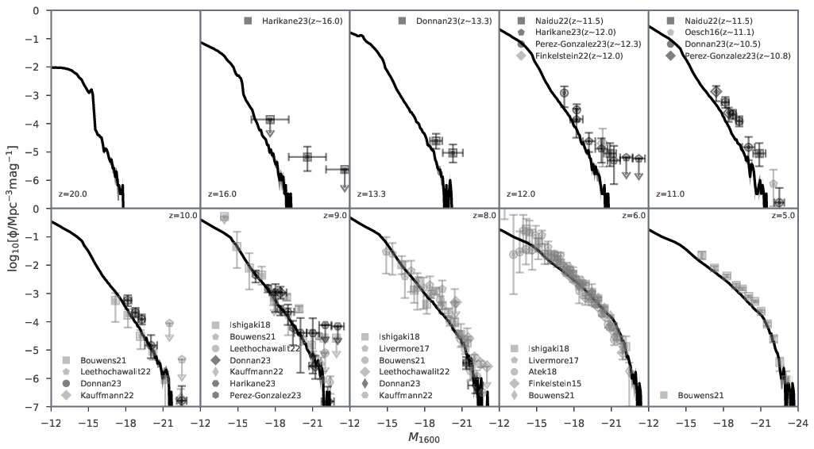

# **Meraxes**
   

---

---

Meraxes is a **semi-analytic galaxy formation model** designed to study the interplay between high-redshift galaxies and their intergalactic medium (IGM) during the Epoch of Reionization (EoR). It  evaluates galaxy properties (e.g., stellar mass, star formation rate, UV luminosity in rest frame or through observational filters such as HST, JWST or other user-defined ones) from dark matter halo merger trees. It computes the photon budget including UV and X-ray, integrating with a customized version of [``21cmFAST``](https://github.com/21cmfast/21cmFAST) to simulate the ionization state and 21-cm signals of the IGM during the EoR.  

A full list of publications directly using Meraxes is available on [ADS](https://ui.adsabs.harvard.edu/public-libraries/CWUcYnt3TsmG6BuOKjR0Fw).  

## **Complementary Tools**
- **[DRAGONS](https://github.com/meraxes-devs/dragons):** A Python package for reading and processing Meraxes output.  
- **[Sector](https://github.com/meraxes-devs/sector):** A library for computing spectral energy distributions from Meraxes simulations.  

## **Installation**
Please refer to [`BUILD.md`](./BUILD.md) for detailed installation and build instructions.

## **Documentation**
Comprehensive documentation is currently under development. For inquiries or assistance, please contact the team.  

## **Acknowledging**
If you use Meraxes or its outputs in your research, please cite the following foundational paper:  

- Mutch et al. (2016). **Dark-ages reionization and galaxy formation simulation - III. Modelling galaxy formation and the epoch of reionization.**  *Monthly Notices of the Royal Astronomical Society*, 462 (1): 250–276. [DOI: 10.1093/mnras/stw1506](https://doi.org/10.1093/mnras/stw1506).  

If using specific features introduced in Meraxes, please cite the corresponding papers:  

- **AGN Model:**  Qin et al. (2017). **Dark-ages reionization and galaxy formation simulation - X. The small contribution of quasars to reionization.** *Monthly Notices of the Royal Astronomical Society*, 472 (2): 2009–2027. [DOI: 10.1093/mnras/stx1909](https://doi.org/10.1093/mnras/stx1909).  

- **SED and Dust Model:**  Qiu et al. (2019). **Dark-age reionization and galaxy formation simulation - XIX. Predictions of infrared excess and cosmic star formation rate density from UV observations** *Monthly Notices of the Royal Astronomical Society*, 489 (1): 1357-1372. [DOI: 10.1093/mnras/stz2233](https://doi.org/10.1093/mnras/stz2233).  

- **21-cm Model:**  Balu et al. (2023). **Thermal and reionization history within a large-volume semi-analytic galaxy formation simulation.**  *Monthly Notices of the Royal Astronomical Society*, 520 (3): 3368–3382. [DOI: 10.1093/mnras/stad281](https://doi.org/10.1093/mnras/stad281).  

- **Minihalo Model:**  Ventura et al. (2024). **Semi-analytic modelling of Pop. III star formation and metallicity evolution - I. Impact on the UV luminosity functions at z = 9–16.** *Monthly Notices of the Royal Astronomical Society*, 529 (1): 628–646. [DOI: 10.1093/mnras/stae567](https://doi.org/10.1093/mnras/stae567).  

## **Contributors**

<table>
  <tbody>
    <tr>
      <td align="center" valign="top" width="19.95%"><a href="https://smutch.github.io/"> <b>Simon Mutch</b></a> <a href="https://github.com/meraxes-devs/meraxes/commits?author=smutch" title="Code">💻</a></td>
      <td align="center" valign="top" width="19.95%"><a href="https://researchportalplus.anu.edu.au/en/persons/yuxiang-qin"> <b>Yuxiang Qin</b></a> <a href="https://github.com/meraxes-devs/meraxes/commits?author=qyx268" title="Code">💻</a> <a href="https://github.com/meraxes-devs/meraxes/pulls?q=is%3Apr+reviewed-by%3Aqyx268" title="Reviewed Pull Requests">👀</a></td>
      <td align="center" valign="top" width="19.95%"><a href="https://github.com/EMventura"> <b>Emanuele Maria Ventura</b></a> <a href="https://github.com/meraxes-devs/meraxes/commits?author=EMventura" title="Code">💻</a> <a href="https://github.com/meraxes-devs/meraxes/pulls?q=is%3Apr+reviewed-by%3AEMventura" title="Reviewed Pull Requests">👀</a></td>
      <td align="center" valign="top" width="19.95%"><a href="http://s-balu.github.io"> <b>Balu Sreedhar</b></a> <a href="https://github.com/meraxes-devs/meraxes/commits?author=s-balu" title="Code">💻</a> <a href="https://github.com/meraxes-devs/meraxes/pulls?q=is%3Apr+reviewed-by%3As-balu" title="Reviewed Pull Requests">👀</a></td>
      <td align="center" valign="top" width="19.95%"><a href="https://github.com/BradGreig"> <b>BradGreig</b></a> <a href="https://github.com/meraxes-devs/meraxes/commits?author=BradGreig" title="Code">💻</a></td>
    </tr>
    <tr>
      <td align="center" valign="top" width="19.95%"><a href="http://www.astronomy.swin.edu.au/~gpoole/"> <b>Gregory B. Poole</b></a> <a href="https://github.com/meraxes-devs/meraxes/commits?author=gbpoole" title="Code">💻</a></td>
      <td align="center" valign="top" width="19.95%"><a href="https://github.com/pgeil"> <b>pgeil</b></a> <a href="https://github.com/meraxes-devs/meraxes/commits?author=pgeil" title="Code">💻</a></td>
      <td align="center" valign="top" width="19.95%"><a href="https://github.com/yqiuu"> <b>Yisheng Qiu</b></a> <a href="https://github.com/meraxes-devs/meraxes/commits?author=yqiuu" title="Code">💻</a></td>
      <td align="center" valign="top" width="19.95%"><a href="https://github.com/daviesje"> <b>daviesje</b></a> <a href="https://github.com/meraxes-devs/meraxes/commits?author=daviesje" title="Code">💻</a></td>
      <td align="center" valign="top" width="19.95%"> <b>Hansik Kim</b></a> 💻</td>
    </tr>
  </tbody>
</table>
